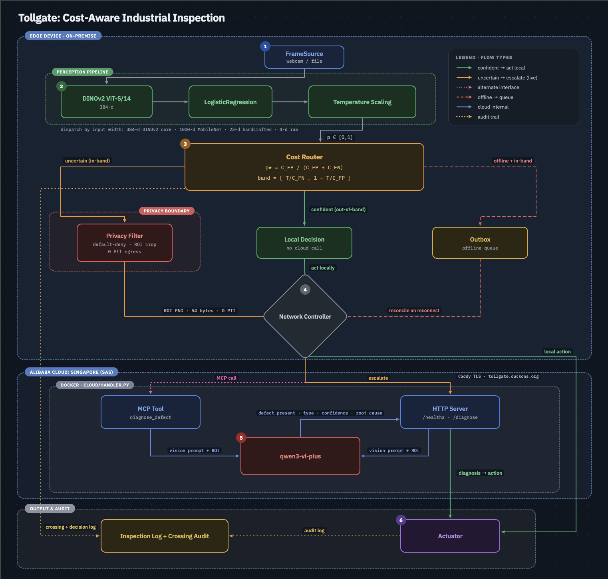

# EdgeAgent

**An edge inspection agent that knows when it needs the cloud, and keeps working when the cloud is gone.**



## The idea

Most inspection systems bolt on privacy, offline support, and cloud orchestration as separate features. EdgeAgent derives all three from one decision: **route frames to the cloud based on cost, not confidence**.

```
band = [T/C_FN,  1 - T/C_FP]     T = C_cloud + ε
```

- **In-band** (uncertain): escalate only the cropped ROI to qwen3.7-plus. Zero raw frames, zero PII.
- **Out-of-band** (confident): decide locally. No cloud call needed.
- **Offline + in-band**: conservative local reject, queue to outbox. Line never stops.
- **Reconnect**: outbox drains, cloud verdict back-fills the record.

One inequality. Three requirements.

## Results

Measured on real MVTec industrial data across six categories:

| Mode | Accuracy | Cost | PII egress |
|---|---|---|---|
| Cloud-only | 0.992 | 100% | 0 |
| **Hybrid (ours)** | **0.988** | **57%** | **0** |
| Local-only | 0.951 | 0% | 0 |

- Six-category robustness: **0.969 ± 0.015** (spread tightened as categories were added)
- Cloud measured live: **100% accuracy**, p99 **12.4 s**. Exactly why you escalate only the uncertain band.
- Backbone ablation: hybrid delta **-0.024 to +0.023** across backbone swaps. The router absorbs local-model variance.
- **148 tests** green

## Stack

- **Edge**: Python 3.11, ONNX (MobileNetV2), temperature-scaled logistic classifier, SQLite outbox
- **Cloud**: qwen3.7-plus via DashScope, served over HTTP from a Docker container on Alibaba SAS
- **Interface**: MCP stdio tool + HTTP (`/healthz`, `/diagnose`), same code path

## Layout

```
edge/    perception · router · privacy · orchestrator · outbox · actuation · store
cloud/   qwen3.7-plus reasoning server (HTTP + MCP)
eval/    MVTec loader · metrics · harness · result scripts
demo/    scripted demo runner · network toggle · video script
tests/   130 unit + integration tests
```

## Quickstart

```bash
pip install -r requirements.txt
pytest tests/ -q
python -m edge.app live --config config.yaml
```

## Reproduce the results

Download any [MVTec AD](https://www.mvtec.com/company/research/datasets/mvtec-ad) category to `data/<category>/`, then:

```bash
python -m eval.train_classifier --data data --category bottle
python -m eval.fit_calibration
python -m eval.run_real_eval
python -m eval.run_multi_category
```

## Robustness features

**Calibration drift detection**: a KS-test detector (`edge/drift.py`) watches the rolling confidence window every 50 frames against the reference distribution saved at calibration time. When the KS statistic exceeds the threshold it switches to conservative mode (escalate everything) until the operator recalibrates, preventing stale probabilities from silently breaking the cost inequality.

**Edge-vs-cloud model drift monitoring**: a rolling disagreement tracker compares local edge decisions against cloud diagnoses on every escalated frame. When disagreement exceeds 20% over the last 100 escalated frames, the orchestrator logs a warning that edge and VLM have drifted apart and recalibration is needed. No ground-truth labels required.

**Concurrent outbox drain**: on reconnect after an offline period, queued escalations are sent to the cloud with a `ThreadPoolExecutor` (4 workers by default) rather than sequentially, preventing API backlogs after extended outages.

**Privacy anonymization**: skin-tone regions within the escalated ROI are blurred via an HSV mask before encoding, so human hands or faces that cross the inspection zone never leave the device as recoverable biometric data.

**Hot-reload cost configuration**: `LiveConfig` re-reads `config.yaml` whenever the file's mtime changes, so operators can tune `C_FN`/`C_FP` for a shift change or a new part family without restarting the process. The escalation band updates automatically.

## Config

All costs live in `config.yaml`. The escalation band is **derived** from them, never hand-tuned.

```yaml
costs:
  C_FN: 100.0   # missed defect
  C_FP: 5.0     # false alarm
  C_cloud: 2.0  # one escalation
  residual_cloud_error: 0.3
```
